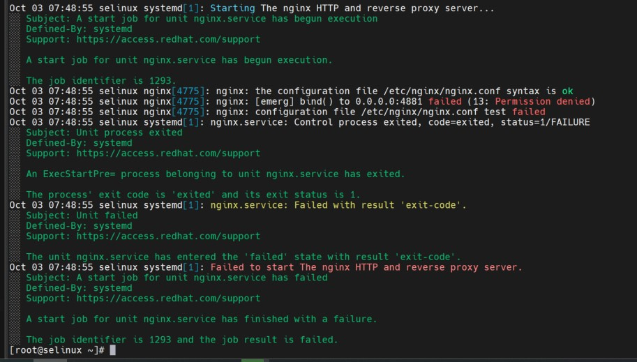
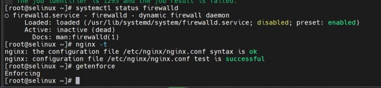

Этап 1: Запустить nginx на нестандартном порту 3-мя разными способами

Разворачиваем ВМ, видим ошибку

смотрим детали

Проверяем фаервол, конфиг Nginx b режим работы SELinux

Проверяем фаервол, конфиг Nginx b режим работы SELinux

Исходя из вывода утилиты, мы видим, что нам нужно поменять параметр nis_enabled.
Видим, что Nginx запустился

Вернём запрет работы nginx на порту 4881 обратно. Для этого отключим nis_enabled

Добавляем нестандартый порт в имеющийся тип. Проверяем, удалем порт.

Формируем модуль. Проверяем, удалем.

Этап 2: Обеспечить работоспособность приложения при включенном selinux

Развернём 2 ВМ с помощью vagrant: vagrant up
После того, как стенд развернется, проверим ВМ с помощью команды: vagrant status
Подключимся к клиенту: vagrant ssh client
Попробуем внести изменения в зону: nsupdate -k /etc/named.zonetransfer.key

Смотрим логи SELinux, чтобы понять в чём может быть проблема.
Для этого воспользуемся утилитой audit2why:
В логах мы видим, что ошибка в контексте безопасности. Вместо типа named_t используется тип etc_t
Проверим данную проблему в каталоге /etc/named:

Изменим тип контекста безопасности для каталога /etc/named: sudo chcon -R -t named_zone_t /etc/named

Проверяем - все работает

Проблема заключалась в том, что конфигурационные файлы лежат в другом каталоге.
