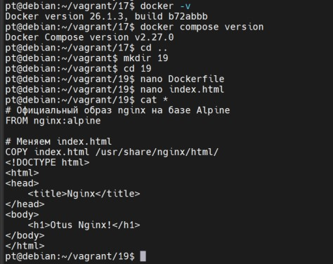
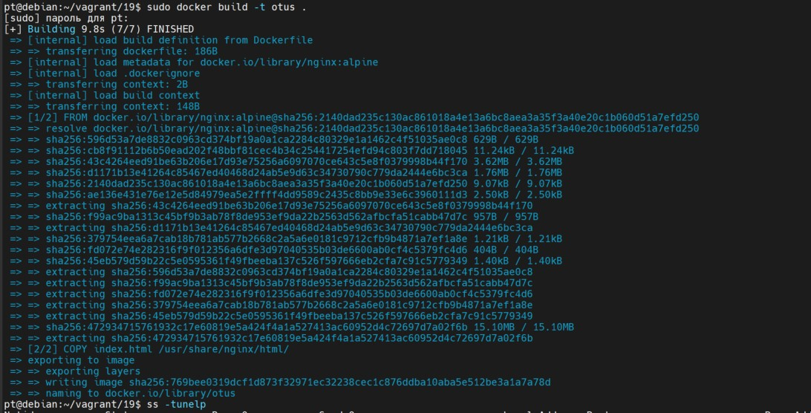
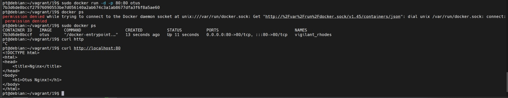

Цель домашнего задания Разобраться с основами docker, с образом, эко системой docker в целом;

1.Создать свой кастомный образ nginx на базе alpine.
После запуска nginx должен отдавать кастомную страницу (достаточно изменить дефолтную страницу nginx).

Сборка образа

Запуск контейнера

2.Определить разницу между контейнером и образом.

Разница между контейнером и образом
Контейнер
Когда контейнер запускается, создается копия файловой системы (образа Docker), которая поддерживает операции чтения и записи. Контейнер Docker (Docker Container) представляет собой изолированную виртуальную среду, предназначенную для запуска приложений, при этом она отделена от хостовой системы. Контейнеры обеспечивают легкую и быструю развертку приложений, что делает их переносимыми и компактными. Они функционируют независимо, поэтому сбой в одном контейнере не влияет на работу других контейнеров или на хостовую систему, поддерживающую их работу.

Каждый Docker-контейнер служит для выполнения одного сервиса, и создается на основе образа (image). Контейнер можно модифицировать, а затем сохранить эти изменения в новый образ с помощью команды:

docker commit 7b3d otusnew:v1.1

Образ
Образ Docker (Docker Image) — это статический, неизменяемый файл, который содержит все необходимые элементы для запуска приложения: исходный код, библиотеки, зависимости и инструменты. Его иногда называют "снимком" (snapshot), так как он представляет состояние приложения и его окружения в определенный момент времени. Поскольку образы предназначены только для чтения, они не могут быть запущены или изменены напрямую. Образ служит шаблоном для создания контейнеров. Он может существовать отдельно, но сам по себе не выполняется.

Образ состоит из нескольких слоев, где каждый слой создается на основе отдельной команды в Dockerfile. Слои образа можно считать файлами, доступными только для чтения, а при создании контейнера поверх них накладывается новый слой, доступный для записи.

Основные особенности:

- Из одного образа можно создать неограниченное количество контейнеров.
- Образ является неизменяемым (read-only), тогда как контейнер — это работающий экземпляр образа с возможностью записи (copy-on-write).

Различие с виртуализацией

Контейнеры виртуализируют процессы на уровне приложений, в отличие от виртуальных машин, где виртуализация происходит на аппаратном уровне. Контейнеры позволяют использовать одну и ту же машину, разделяя её ядро и изолируя приложения друг от друга. Это делает контейнеры лёгкими, эффективно использующими ресурсы системы.

Можно ли собрать ядро в контейнере?
Сборка ядра внутри контейнера возможна. В контейнерах удобно собирать проекты из исходного кода, что облегчает дальнейшее распространение и доставку собранного продукта.
