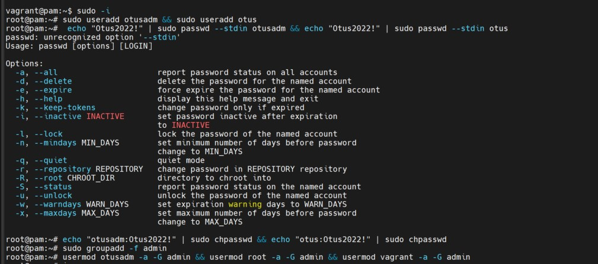
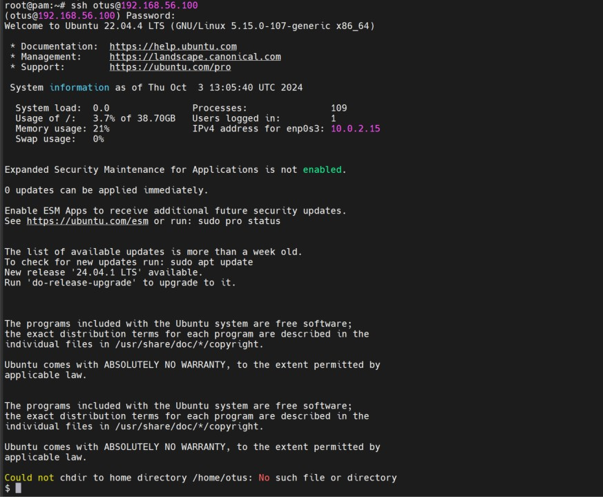
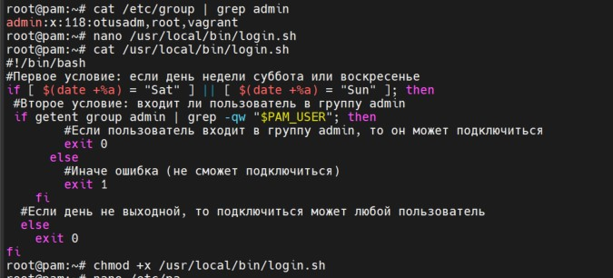
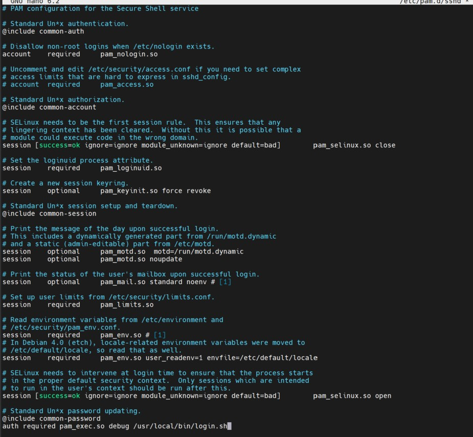
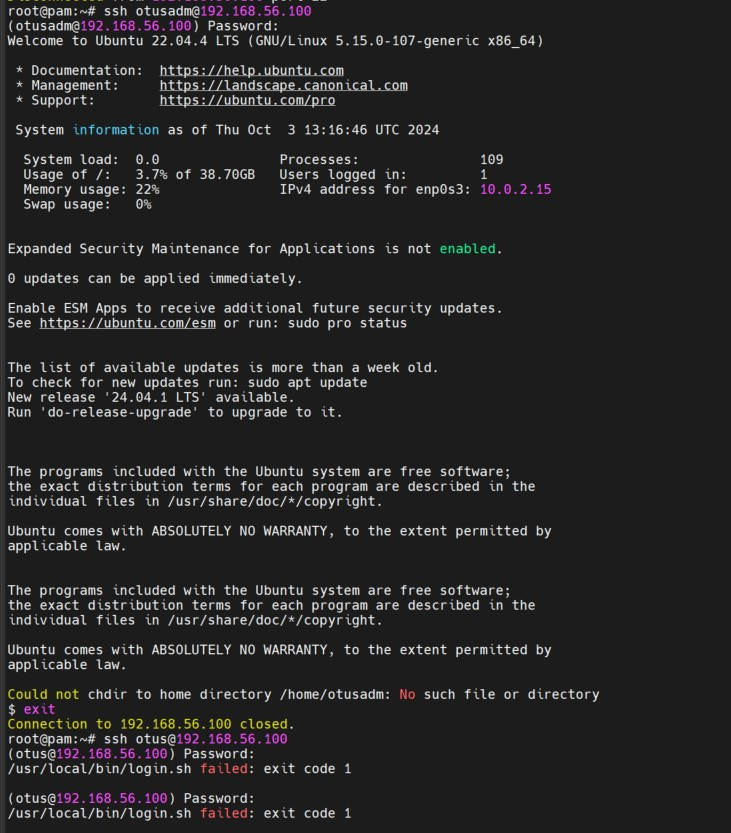

Развернул ВМ
Создал пользователя otusadm и otus
Задал пароли (в методичке команда неверная)
Создал группу admin
Добавил пользователей vagrant,root и otusadm в группу admin

Проверяем подключение по ssh

Настроил правило, по которому все пользователи кроме тех, что указаны в группе admin не смогут подключаться в выходные дни

Для проверки изменил запрет подключения на четверг
