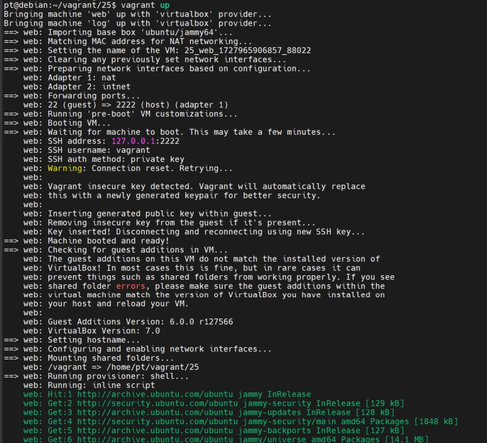
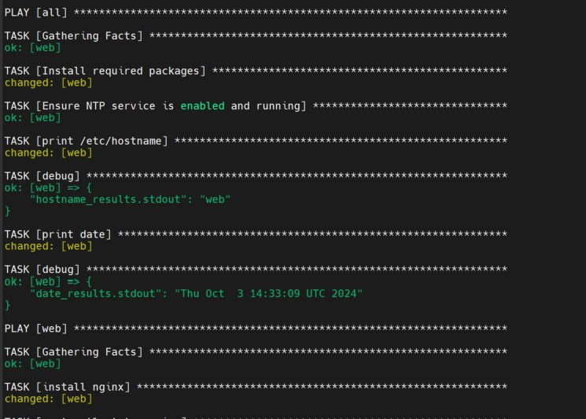
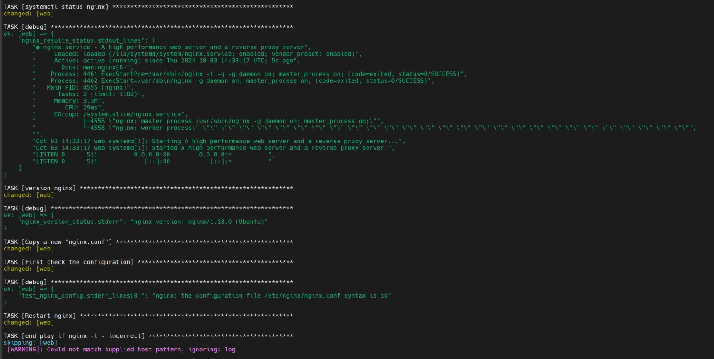
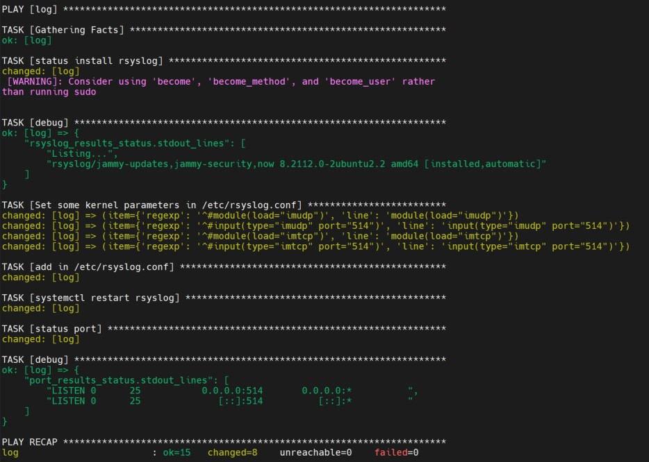

1.С помощью Vagrant разворачиваем ВМ web и log.

  

2. И запускаем playbook

[playbook](playbook.yml)

Устанавливаем необходимые пакеты
  

nginx работает корректно. Меняем nginx.conf, проверяем конфигурацию

Настраиваем Log

Все работает, порты TCP,UDP 514 открыты  