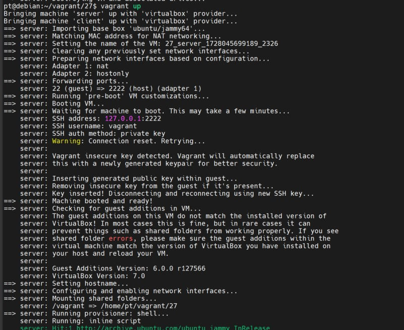
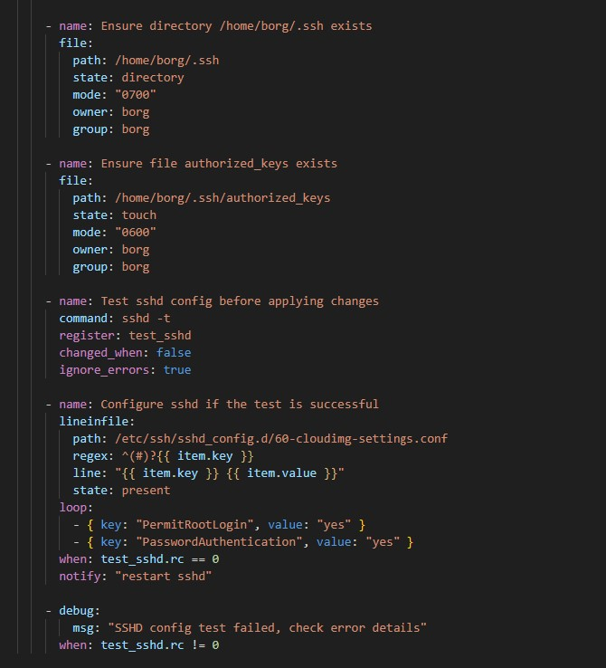
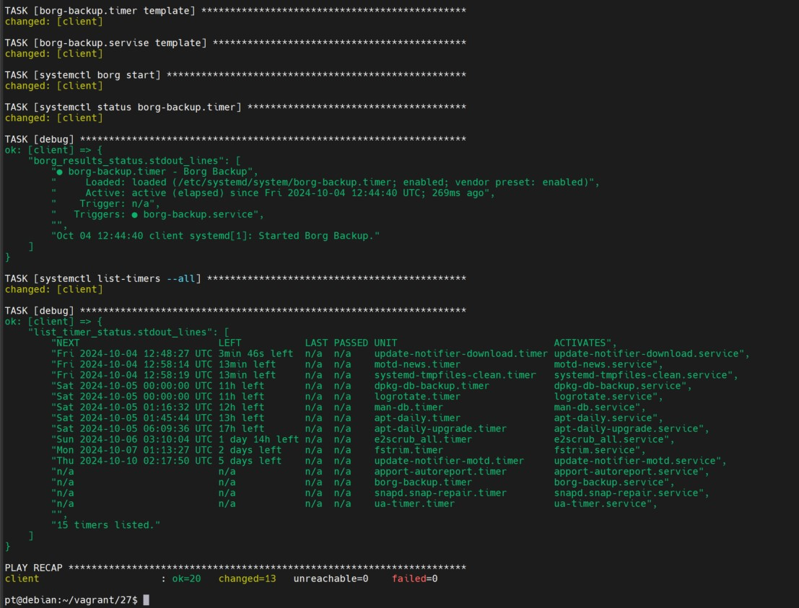

Домашнее задание Резервное копирование
Цель домашнего задания
Научиться настраивать резервное копирование с помощью утилиты Borg

1. Разворачиваем стенд Vagrant с двумя ВМ backup_server и client.

  

2. И запускаем playbook

[playbook](playbook.yml)

Устанавливаем необходимые пакеты

tasks:
    - name: install packages
      apt:
        update_cache: yes
        name: "{{ packages }}"
        state: present
      vars:
        packages:
          - borgbackup
          - mc
          - sshpass

На backup создаем пользователя

    - name: Create a user 'borg'
      shell: useradd -m -s /bin/bash -p $(openssl passwd -6 1234) borg
      ignore_errors: yes

Настраиваем SSH

Генерация SSH ключей и копирование их на сервер

    - name: Generate ssh-key-gen
      command: ssh-keygen -q -t rsa  -f /root/.ssh/id_rsa  -N ''
    - name: ssh-copy-id to server
      shell: >
        sshpass -p 1234 ssh-copy-id -i /root/.ssh/id_rsa.pub -o
        StrictHostKeyChecking=no borg@192.168.56.12

Инициализация репозитория BorgBackup и создание резервной копии 

    - name: borg init
      shell: borg init -e none borg@192.168.56.12:/var/backup/
    - name: borg create
      shell: borg create --stats --list
        borg@192.168.56.12:/var/backup/::"etc-{now:%Y-%m-%d_%H:%M:%S}" /etc

Настройка таймера и сервиса systemd

    - name: borg-backup.timer template
      template:
        src: timer.j2
        dest: "{{ conf_file_timer }}"
        mode: "0644"
    - name: borg-backup.servise template
      template:
        src: service.j2
        dest: "{{ conf_file_service }}"
        mode: "0644"

Все работает

