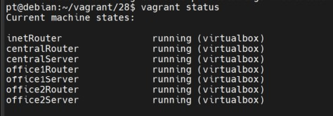
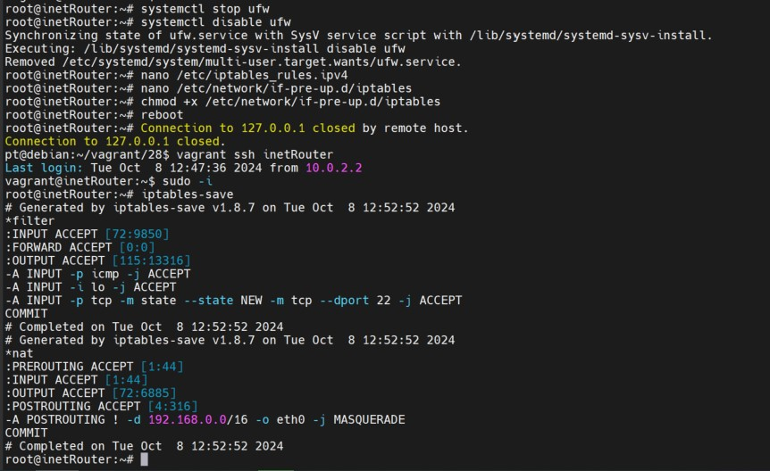

Домашнее задание Сетевая лабратория

задание:

Найти свободные подсети

Посчитать сколько узлов в каждой подсети, включая свободные

Указать broadcast адрес для каждой подсети

Проверить нет ли ошибок при разбиении

Получилась вот такая таблица:

  

Свободные подсети

- 192.168.0.16/28
- 192.168.0.48/28
- 192.168.0.128/25
- 192.168.255.64/26
- 192.168.255.32/27
- 192.168.255.16/28
- 192.168.255.8/29
- 192.168.255.4/30

ошибок при разбиении нет

Практическая часть

С помощью Vagrant разворачиваем 7 ВМ

vagrant up

- inetRouter
- centralRouter
- office1Router
- office2Router
- centralServer
- office1Server
- office2Server

 

Настраиваем NAT и проверяем

