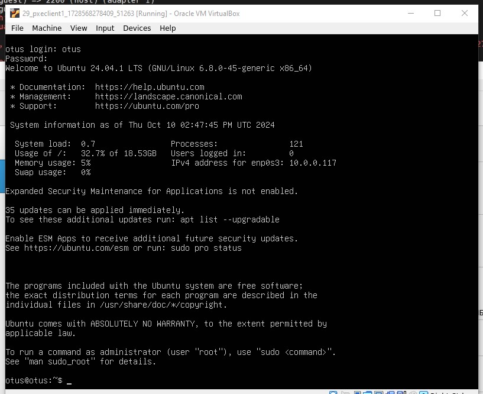

Описание домашнего задания
1. Настроить загрузку по сети дистрибутива Ubuntu 24
2. Установка должна проходить из HTTP-репозитория.
3. Настроить автоматическую установку c помощью файла user-data

Разворачиваем стенд Vagrant с двумя ВМ pxeserver и pxeclient1.

  

Запускается playbook
Отключает UFW
Устанавливает dnsmasq
Копирует конфиг dnsmasq
Устанавливает Apache
Копирует конфиг Apache
Активирует сайт в Apache
Создает директории
Скачивает образ Ubuntu
Скачивает и распаковывает netboot
Копирует конфиги PXE
Перезапускает dnsmasq
Перезапускает Apache

Видим что pxeclient1 создана и запущена

Подключаемся через GUI и видим что установка запустилась

Готово

