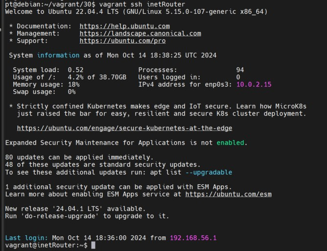
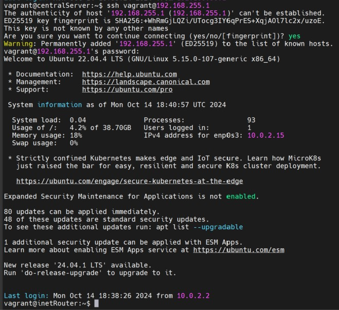
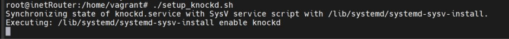
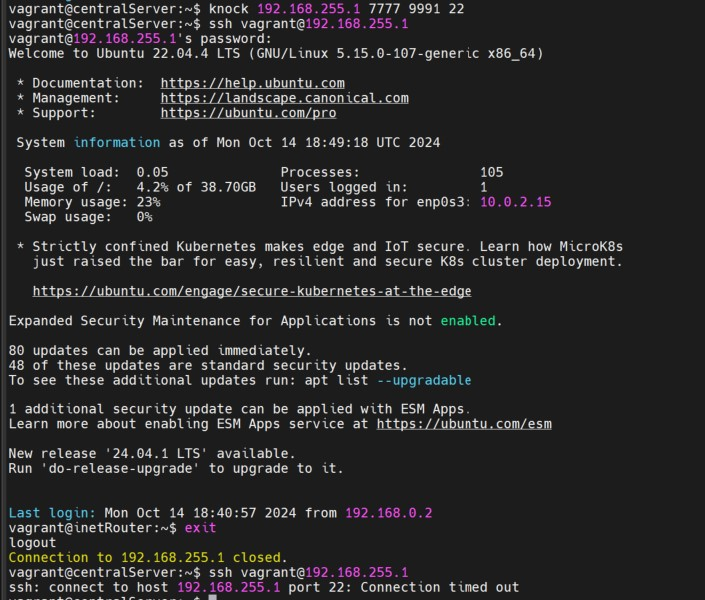
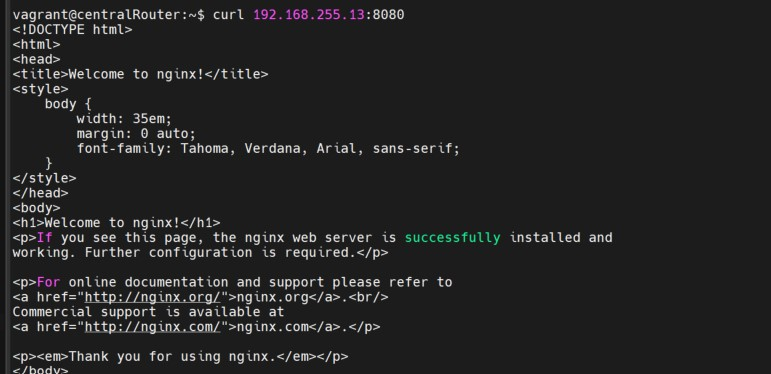

Домашнее задание: Сценарии iptables

задание:

реализовать knocking port
centralRouter может попасть на ssh inetrRouter через knock скрипт
пример в материалах.
добавить inetRouter2, который виден(маршрутизируется (host-only тип сети для виртуалки)) с хоста или форвардится порт через локалхост.
запустить nginx на centralServer.
пробросить 80й порт на inetRouter2 8080.

Запускаем vagrant up и наслаждаемся

Подключаемся по ssh к inetRouter 

  

Подключаемся по ssh к inetRouter c centralServer

Запускаем скрипт, который меняет настройки iptables и knock

ssh отваливается

Доступ закрыт, стучим и подключаемся

Порт для nginx проброшет плейбуком, проверяем

