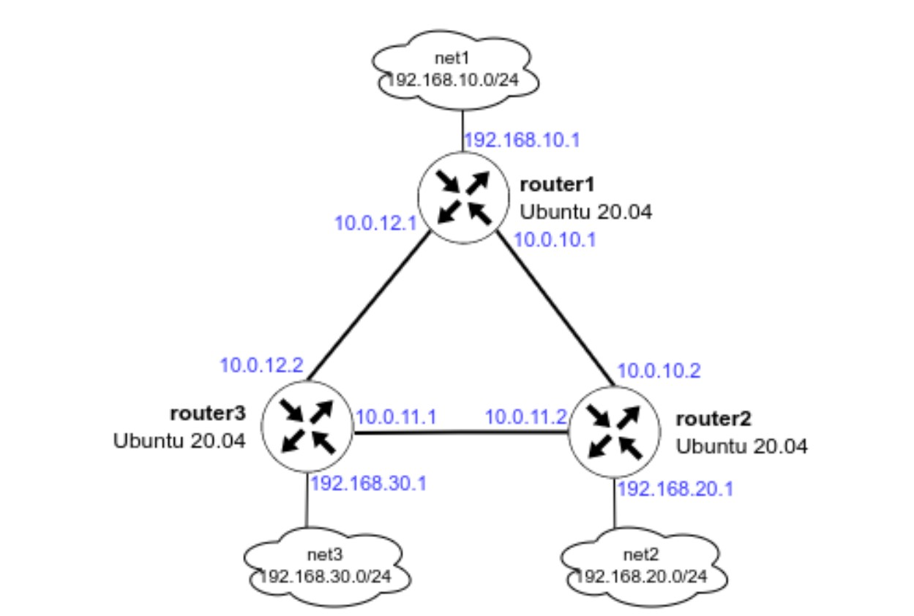
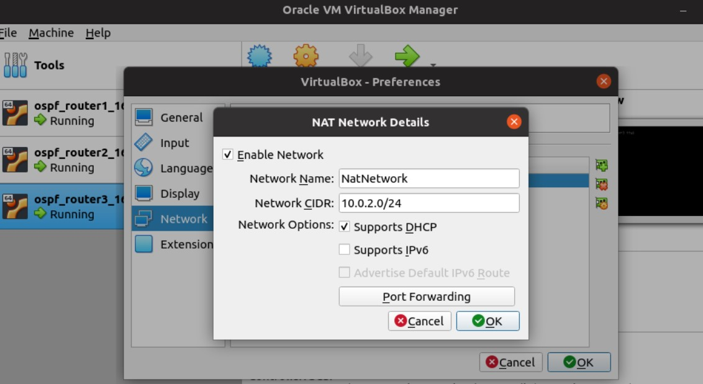

Задание:

1. Развернуть 3 виртуальные машины
2. Объединить их разными vlan
- настроить OSPF между машинами на базе Quagga;
- изобразить ассиметричный роутинг;
- сделать один из линков "дорогим", но что бы при этом роутинг был симметричным. 


Разворачиваем 3 виртуальные машины согласно схемы:




Проверяем настройки сети




vagrant up


Результатом выполнения данной команды будут 3 созданные виртуальные машины, которые соединены между собой сетями (10.0.10.0/30, 10.0.11.0/30 и 10.0.12.0/30). У каждого роутера есть дополнительная сеть:

- на router1 — 192.168.10.0/24
- на router2 — 192.168.20.0/24
- на router3 — 192.168.30.0/24


Проверим доступность сетей с хоста router1:

- попробуем сделать ping до ip-адреса 192.168.30.1

```bash
ping 192.168.30.1
PING 192.168.30.1 (192.168.30.1) 56(84) bytes of data.
64 bytes from 192.168.30.1: icmp_seq=1 ttl=64 time=0.743 ms
64 bytes from 192.168.30.1: icmp_seq=2 ttl=64 time=0.958 ms
64 bytes from 192.168.30.1: icmp_seq=3 ttl=64 time=0.913 ms
64 bytes from 192.168.30.1: icmp_seq=4 ttl=64 time=0.970 ms
64 bytes from 192.168.30.1: icmp_seq=5 ttl=64 time=1.02 ms
^C
--- 192.168.30.1 ping statistics ---
5 packets transmitted, 5 received, 0% packet loss, time 4009ms
rtt min/avg/max/mdev = 0.743/0.920/1.017/0.094 ms
```

- Запустим трассировку до адреса 192.168.30.1

```bash
traceroute 192.168.30.1
traceroute to 192.168.30.1 (192.168.30.1), 30 hops max, 60 byte packets
 1  ubuntu22 (192.168.30.1)  0.762 ms  0.685 ms  0.909 ms
```

Попробуем отключить интерфейс enp0s9 и немного подождем и снова запустим трассировку до ip-адреса 192.168.30.1

```bash
ifconfig enp0s9 down

ip a | grep enp0s9
4: enp0s9: <BROADCAST,MULTICAST> mtu 1500 qdisc fq_codel state DOWN group default qlen 1000

traceroute 192.168.30.1

traceroute 192.168.30.1
traceroute to 192.168.30.1 (192.168.30.1), 30 hops max, 60 byte packets
 1  10.0.10.2 (10.0.10.2)  0.933 ms  0.853 ms  0.814 ms
 2  ubuntu22 (192.168.30.1)  1.574 ms  1.311 ms  1.266 ms
```

Как мы видим, после отключения интерфейса сеть 192.168.30.0/24 нам остаётся доступна.

Также мы можем проверить из интерфейса vtysh какие маршруты мы видим на данный момент:

```bash
vtysh

Hello, this is FRRouting (version 8.2.2).
Copyright 1996-2005 Kunihiro Ishiguro, et al.

show ip route ospf
Codes: K - kernel route, C - connected, S - static, R - RIP,
       O - OSPF, I - IS-IS, B - BGP, E - EIGRP, N - NHRP,
       T - Table, v - VNC, V - VNC-Direct, A - Babel, F - PBR,
       f - OpenFabric,
       > - selected route, * - FIB route, q - queued, r - rejected, b - backup
       t - trapped, o - offload failure

O   10.0.10.0/30 [110/100] is directly connected, enp0s8, weight 1, 00:05:51
O>* 10.0.11.0/30 [110/200] via 10.0.10.2, enp0s8, weight 1, 00:03:29
O>* 10.0.12.0/30 [110/300] via 10.0.10.2, enp0s8, weight 1, 00:03:04
O   192.168.10.0/24 [110/100] is directly connected, enp0s10, weight 1, 00:07:04
O>* 192.168.20.0/24 [110/200] via 10.0.10.2, enp0s8, weight 1, 00:05:39
O>* 192.168.30.0/24 [110/300] via 10.0.10.2, enp0s8, weight 1, 00:03:29
```

- Включим интерфейс обратно

```bash
ifconfig enp0s9 up
```


### Настройка ассиметричного роутинга

Для настройки ассиметричного роутинга нам необходимо выключить блокировку ассиметричной маршрутизации: sysctl net.ipv4.conf.all.rp_filter=0

Далее, выбираем один из роутеров, на котором изменим «стоимость интерфейса». Например поменяем стоимость интерфейса enp0s8 на router1:

```bash
vtysh

Hello, this is FRRouting (version 8.2.2).
Copyright 1996-2005 Kunihiro Ishiguro, et al.

conf t
int enp0s8
ip ospf cost 1000
exit
exit
show ip route ospf

Codes: K - kernel route, C - connected, S - static, R - RIP,
       O - OSPF, I - IS-IS, B - BGP, E - EIGRP, N - NHRP,
       T - Table, v - VNC, V - VNC-Direct, A - Babel, F - PBR,
       f - OpenFabric,
       > - selected route, * - FIB route, q - queued, r - rejected, b - backup
       t - trapped, o - offload failure

O   10.0.10.0/30 [110/300] via 10.0.12.2, enp0s9, weight 1, 00:00:12
O>* 10.0.11.0/30 [110/200] via 10.0.12.2, enp0s9, weight 1, 00:00:12
O   10.0.12.0/30 [110/100] is directly connected, enp0s9, weight 1, 00:03:33
O   192.168.10.0/24 [110/100] is directly connected, enp0s10, weight 1, 00:03:33
O>* 192.168.20.0/24 [110/300] via 10.0.12.2, enp0s9, weight 1, 00:00:12
O>* 192.168.30.0/24 [110/200] via 10.0.12.2, enp0s9, weight 1, 00:02:59
```

На router2

```bash
vtysh

Hello, this is FRRouting (version 8.2.2).
Copyright 1996-2005 Kunihiro Ishiguro, et al.

show ip route ospf
Codes: K - kernel route, C - connected, S - static, R - RIP,
       O - OSPF, I - IS-IS, B - BGP, E - EIGRP, N - NHRP,
       T - Table, v - VNC, V - VNC-Direct, A - Babel, F - PBR,
       f - OpenFabric,
       > - selected route, * - FIB route, q - queued, r - rejected, b - backup
       t - trapped, o - offload failure

O   10.0.10.0/30 [110/100] is directly connected, enp0s8, weight 1, 00:04:38
O   10.0.11.0/30 [110/100] is directly connected, enp0s9, weight 1, 00:04:38
O>* 10.0.12.0/30 [110/200] via 10.0.10.1, enp0s8, weight 1, 00:03:58
  *                        via 10.0.11.1, enp0s9, weight 1, 00:03:58
O>* 192.168.10.0/24 [110/200] via 10.0.10.1, enp0s8, weight 1, 00:03:58
O   192.168.20.0/24 [110/100] is directly connected, enp0s10, weight 1, 00:04:38
O>* 192.168.30.0/24 [110/200] via 10.0.11.1, enp0s9, weight 1, 00:03:58
```

После внесения данных настроек, мы видим, что маршрут до сети 192.168.20.0/30 теперь пойдёт через router3, но обратный трафик от router2 пойдёт по другому пути.

Давайте это проверим:

- На router1 запускаем пинг от 192.168.10.1 до 192.168.20.1: ping -I 192.168.10.1 192.168.20.1
- На router2 запускаем tcpdump, который будет смотреть трафик только на порту enp0s9:

```bash
tcpdump -i enp0s9

17:03:23.793254 IP 192.168.10.1 > router2: ICMP echo request, id 8, seq 51, length 64
17:03:24.794375 IP 192.168.10.1 > router2: ICMP echo request, id 8, seq 52, length 64
17:03:25.809719 IP 192.168.10.1 > router2: ICMP echo request, id 8, seq 53, length 64
17:03:26.832828 IP 192.168.10.1 > router2: ICMP echo request, id 8, seq 54, length 64
17:03:27.857653 IP 192.168.10.1 > router2: ICMP echo request, id 8, seq 55, length 64
17:03:28.858986 IP 192.168.10.1 > router2: ICMP echo request, id 8, seq 56, length 64
17:03:29.873955 IP 192.168.10.1 > router2: ICMP echo request, id 8, seq 57, length 64
17:03:30.876495 IP 192.168.10.1 > router2: ICMP echo request, id 8, seq 58, length 64
17:03:31.878297 IP 192.168.10.1 > router2: ICMP echo request, id 8, seq 59, length 64
```

> Видим что данный порт только получает ICMP-трафик с адреса 192.168.10.1

На router2 запускаем tcpdump, который будет смотреть трафик только на порту enp0s8:

```bash
tcpdump -i enp0s8

17:08:13.594894 IP router2 > 192.168.10.1: ICMP echo reply, id 8, seq 159, length 64
17:08:14.595704 IP router2 > 192.168.10.1: ICMP echo reply, id 8, seq 160, length 64
17:08:15.601049 IP router2 > 192.168.10.1: ICMP echo reply, id 8, seq 161, length 64
17:08:16.624664 IP router2 > 192.168.10.1: ICMP echo reply, id 8, seq 162, length 64
17:08:17.648986 IP router2 > 192.168.10.1: ICMP echo reply, id 8, seq 163, length 64
17:08:18.672813 IP router2 > 192.168.10.1: ICMP echo reply, id 8, seq 164, length 64
17:08:19.697714 IP router2 > 192.168.10.1: ICMP echo reply, id 8, seq 165, length 64
17:08:20.727868 IP router2 > 192.168.10.1: ICMP echo reply, id 8, seq 166, length 64
17:08:21.727990 IP router2 > 192.168.10.1: ICMP echo reply, id 8, seq 167, length 64
17:08:22.736613 IP router2 > 192.168.10.1: ICMP echo reply, id 8, seq 168, length 64
```

> Видим что данный порт только отправляет ICMP-трафик на адрес 192.168.10.1

Таким образом мы видим ассиметричный роутинг.

Настройка ассиметричного роутинга с помощью Ansible

```yml
    # Отключаем запрет ассиметричного роутинга
    - name: set up asynchronous routing
      sysctl:
        name: net.ipv4.conf.all.rp_filter
        value: '0'
        state: present
    # Делаем интерфейс enp0s8 в router1 «дорогим»
    - name: set up OSPF
      template:
        src: frr.conf.j2
        dest: /etc/frr/frr.conf
        owner: frr
        group: frr
        mode: 0640
    # Применяем настройки
    - name: restart FRR
      service:
        name: frr
        state: restarted
        enabled: true
```

Пример добавления «дорогого» интерфейса в template frr.conf

```bash

  ip ospf cost 1000

  !ip ospf cost 450

```

В данном примере, проверяется имя хоста, и, если имя хоста «router1», то в настройку интерфейса enp0s8 добавляется стоимость 1000, в остальных случаях настройка комментируется…

### Настройка симметичного роутинга

Так как у нас уже есть один «дорогой» интерфейс, нам потребуется добавить ещё один дорогой интерфейс, чтобы у нас перестала работать ассиметричная маршрутизация.

Так как в прошлом задании мы заметили что router2 будет отправлять обратно трафик через порт enp0s8, мы также должны сделать его дорогим и далее проверить, что теперь используется симметричная маршрутизация:

Поменяем стоимость интерфейса enp0s8 на router2:

```bash
vtysh

Hello, this is FRRouting (version 8.2.2).
Copyright 1996-2005 Kunihiro Ishiguro, et al.

conf t
int enp0s8
ip ospf cost 1000
exit
exit

show ip route ospf

Codes: K - kernel route, C - connected, S - static, R - RIP,
       O - OSPF, I - IS-IS, B - BGP, E - EIGRP, N - NHRP,
       T - Table, v - VNC, V - VNC-Direct, A - Babel, F - PBR,
       f - OpenFabric,
       > - selected route, * - FIB route, q - queued, r - rejected, b - backup
       t - trapped, o - offload failure

O   10.0.10.0/30 [110/1000] is directly connected, enp0s8, weight 1, 00:00:10
O   10.0.11.0/30 [110/100] is directly connected, enp0s9, weight 1, 00:24:23
O>* 10.0.12.0/30 [110/200] via 10.0.11.1, enp0s9, weight 1, 00:00:10
O>* 192.168.10.0/24 [110/300] via 10.0.11.1, enp0s9, weight 1, 00:00:10
O   192.168.20.0/24 [110/100] is directly connected, enp0s10, weight 1, 00:24:23
O>* 192.168.30.0/24 [110/200] via 10.0.11.1, enp0s9, weight 1, 00:23:43

exit
```

После внесения данных настроек, мы видим, что маршрут до сети 192.168.10.0/30 пойдёт через router3.

Давайте это проверим:

- На router1 запускаем пинг от 192.168.10.1 до 192.168.20.1: ping -I 192.168.10.1 192.168.20.1
- На router2 запускаем tcpdump, который будет смотреть трафик только на порту enp0s9:

```bash
tcpdump -i enp0s9


17:37:24.812303 IP 192.168.10.1 > router2: ICMP echo request, id 10, seq 34, length 64
17:37:24.812336 IP router2 > 192.168.10.1: ICMP echo reply, id 10, seq 34, length 64
17:37:25.896896 IP 192.168.10.1 > router2: ICMP echo request, id 10, seq 35, length 64
17:37:25.896941 IP router2 > 192.168.10.1: ICMP echo reply, id 10, seq 35, length 64
17:37:26.898998 IP 192.168.10.1 > router2: ICMP echo request, id 10, seq 36, length 64
17:37:26.899024 IP router2 > 192.168.10.1: ICMP echo reply, id 10, seq 36, length 64
17:37:27.911954 IP 192.168.10.1 > router2: ICMP echo request, id 10, seq 37, length 64
17:37:27.912088 IP router2 > 192.168.10.1: ICMP echo reply, id 10, seq 37, length 64
17:37:28.913899 IP 192.168.10.1 > router2: ICMP echo request, id 10, seq 38, length 64
17:37:28.913937 IP router2 > 192.168.10.1: ICMP echo reply, id 10, seq 38, length 64
17:37:29.937532 IP 192.168.10.1 > router2: ICMP echo request, id 10, seq 39, length 64
17:37:29.937560 IP router2 > 192.168.10.1: ICMP echo reply, id 10, seq 39, length 64
17:37:30.930521 IP 192.168.10.1 > router2: ICMP echo request, id 10, seq 40, length 64
17:37:30.930555 IP router2 > 192.168.10.1: ICMP echo reply, id 10, seq 40, length 64
17:37:32.108018 IP 192.168.10.1 > router2: ICMP echo request, id 10, seq 41, length 64
17:37:32.108048 IP router2 > 192.168.10.1: ICMP echo reply, id 10, seq 41, length 64
```

> Теперь мы видим, что трафик между роутерами ходит симметрично.

Настройка симметричного роутинга с помощью Ansible

Настройка симметричного роутинга заключается в том, чтобы добавить правильную настройку в файл /etc/frr/frr.conf

Далее, файл необходимо также отправить на хосты и перезапустить FRR.

Чтобы было легко переключаться между ассиметричным и симметричным роутингом, мы можем добавить переменную symmetric_routing со значением по умолчанию false в файл defaults/main.yml

symmetric_routing: false

Далее в template frr.conf добавим условие:

```bash

  ip ospf cost 1000

  ip ospf cost 1000

  !ip ospf cost 45

```

Данное условие проверят имя хоста и переменную symmetric_routing и добавляет в темплейт следующие параметры:

- Если имя хоста router1 — то добавляется стоимость интерфейса 1000
- Если имя хоста router2 И значение параметра symmetric_routing true — то добавляется стоимость интерфейса 1000
- В остальных случаях добавляется закомментированный параметр

Для удобного переключения параметров нам потребуется запускать из ansible-playbook только 2 последних модуля. Чтобы не ждать выполнения всего плейбука, можно добавить тег к модулям:

```bash
    - name: set up OSPF
      template:
        src: frr.conf.j2
        dest: /etc/frr/frr.conf
        owner: frr
        group: frr
        mode: 0640
      tags:
        - setup_ospf
    - name: restart FRR
      service:
        name: frr
        state: restarted
        enabled: true
      tags:
        - setup_ospf
```

Тогда можно будет запускать playbook не полностью. Пример запуска модулей из ansible-playbook, которые помечены тегами:

```bash
ansible-playbook -i ansible/hosts -l all ansible/provision.yml -t setup_ospf -e "host_key_checking=false"
```