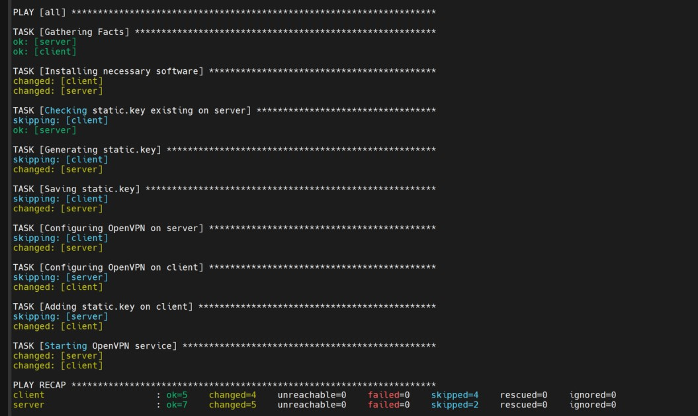
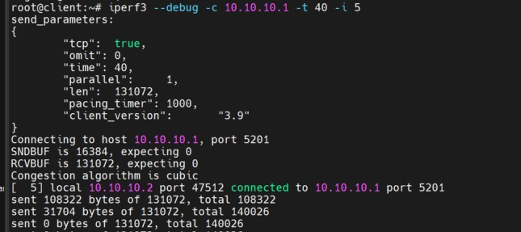

VPN

Задание:

1. Настроить VPN между двумя ВМ в tun/tap режимах, замерить скорость в туннелях, сделать вывод об отличающихся показателях
2. Поднять RAS на базе OpenVPN с клиентскими сертификатами, подключиться с локальной машины на ВМ


Разворачиваем 2 виртуальные машины:

Vagrant up



Проводим замеры скорости в туннеле для режима TAP:



Аналогично делаем для TUN

Результаты замеров скорости в туннелях с использованием режимов TAP и TUN оказались практически одинаковыми. Стоит отметить, что TUN и TAP являются драйверами виртуальных сетевых устройств. В режиме TAP эмулируется Ethernet-устройство и работа осуществляется на канальном уровне модели OSI с использованием ethernet-кадров, а в режиме TUN работа осуществляется на сетевом уровне модели OSI с использованием IP-пакетов. Логика работы указанных режимов говорит о том, что на практике TUN должен иметь более высокую производительность из-за отсутствия накладных расходов, таких как, например, обработка широковещательных адресов, характерных для режима TAP.


Настройка RAS на базе OpenVPN.

   - Установка необходимого ПО на сервер. В частности, пакет easy-rsa необходим для развёртывания центра серитификации:

   ```shell
   apt update
   apt install -y openvpn easy-rsa
   ```
   - Инициализация PKI:

   ```shell
   cd /etc/openvpn
   /usr/share/easy-rsa/easyrsa init pki
   ```
   - Генерирование необходимых серитификатов и ключей для сервера:

   ```shell
   echo 'rasvpn' | /usr/share/easy-rsa/easyrsa build-ca nopass
   echo 'rasvpn' | /usr/share/easy-rsa/easyrsa gen-req server nopass
   echo 'yes' | /usr/share/easy-rsa/easyrsa sign-req server server
   /usr/share/easy-rsa/easyrsa gen-dh
   openvpn --genkey --secret ta.key
   ```
   - Генерирование сертификатов для клиента:

   ```shell
   echo 'client' | /usr/share/easy-rsa/easyrsa gen-req client nopass
   echo 'yes' | /usr/share/easy-rsa/easyrsa sign-req client client
   ```
   - Подготовка на сервере конфигурационного файла сервиса OpenVPN:

   ```shell
   nano /etc/openvpn/server.conf
   ...
   cat /etc/openvpn/server.conf
   port 1207
   proto udp
   dev tun
   ca /etc/openvpn/pki/ca.crt
   cert /etc/openvpn/pki/issued/server.crt
   key /etc/openvpn/pki/private/server.key
   dh /etc/openvpn/pki/dh.pem
   server 10.10.10.0 255.255.255.0
   push "route 192.168.56.0 255.255.255.0"
   ifconfig-pool-persist ipp.txt
   client-to-client
   client-config-dir /etc/openvpn/client
   keepalive 10 120
   comp-lzo
   persist-key
   persist-tun
   status /var/log/openvpn-status.log
   log /var/log/openvpn.log
   verb 3
   ```
   - Задание параметра iroute для клиента:

   ```shell
   echo 'iroute 192.168.56.0 255.255.255.0' > /etc/openvpn/client/client
   ```
   - Копирование указанных ниже файлов сертификатов и ключа на клентскую машину:

   ```shell
   /etc/openvpn/pki/ca.crt
   /etc/openvpn/pki/issued/client.crt
   /etc/openvpn/pki/private/client.key

  root@client: # ls -al /etc/openvpn
   итого 64
   drwxr-xr-x 1 root root   144 июл 28 12:58 .
   drwxr-xr-x 1 root root  3948 июл 30 11:51 ..
   -rw------- 1 dem  guest 1184 июл 28 12:38 ca.crt
   -rw-r--r-- 1 root root   160 июл 28 12:58 client.conf
   -rw------- 1 dem  guest 4471 июл 28 12:45 client.crt
   -rw------- 1 dem  guest 1704 июл 28 12:44 client.key
   -rwxr-xr-x 1 root root   943 июн  6 13:07 down.sh
   -rw-r--r-- 1 root root     0 июн  6 13:07 .keep_net-vpn_openvpn-0
   -rwxr-xr-x 1 root root  2865 июн  6 13:07 up.sh
   ```
   - Конфиг файл сервиса OpenVPN:

   ```shell
   nano /etc/openvpn/client.conf
   ...
   cat /etc/openvpn/client.conf
   dev tun
   proto udp
   remote 192.168.56.10 1207
   client
   resolv-retry infinite
   ca ./ca.crt
   cert ./client.crt
   key ./client.key
   persist-key
   persist-tun
   comp-lzo
   verb 3
   ```
   - Подлючение к серверу OpenVPN:

   ```shell
   root@client:/etc/openvpn# openvpn --config client.conf
   2024-10-17 16:00:11 WARNING: Compression for receiving enabled. Compression has been used in the past to break encryption. Sent packets are not compressed unless "allow-compression yes" is also set.
   2024-10-17 16:00:11 Note: --cipher is not set. OpenVPN versions before 2.5 defaulted to BF-CBC as fallback when cipher negotiation failed in this case. If you need this fallback please add '--data-ciphers-fallback BF-CBC' to your configuration and/or add BF-CBC to --data-ciphers.
   2024-10-17 16:00:11 OpenVPN 2.6.9 x86_64-pc-linux-gnu [SSL (OpenSSL)] [LZO] [LZ4] [EPOLL] [MH/PKTINFO] [AEAD]
   2024-10-17 16:00:11 library versions: OpenSSL 3.0.13 30 Jan 2024, LZO 2.10
   2024-10-17 16:00:11 WARNING: No server certificate verification method has been enabled.  See http://openvpn.net/howto.html#mitm for more info.
   2024-10-17 16:00:11 TCP/UDP: Preserving recently used remote address: [AF_INET]192.168.56.10:1207
   2024-10-17 16:00:11 Socket Buffers: R=[212992->212992] S=[212992->212992]
   2024-10-17 16:00:11 UDPv4 link local: (not bound)
   2024-10-17 16:00:11 UDPv4 link remote: [AF_INET]192.168.56.10:1207
   2024-10-17 16:00:11 TLS: Initial packet from [AF_INET]192.168.56.10:1207, sid=c5707599 e1e34c53
   2024-10-17 16:00:11 VERIFY OK: depth=1, CN=rasvpn
   2024-10-17 16:00:11 VERIFY OK: depth=0, CN=rasvpn
   2024-10-17 16:00:11 Control Channel: TLSv1.3, cipher TLSv1.3 TLS_AES_256_GCM_SHA384, peer certificate: 2048 bits RSA, signature: RSA-SHA256, peer temporary key: 253 bits X25519
   2024-10-17 16:00:11 [rasvpn] Peer Connection Initiated with [AF_INET]192.168.56.10:1207
   2024-10-17 16:00:11 TLS: move_session: dest=TM_ACTIVE src=TM_INITIAL reinit_src=1
   2024-10-17 16:00:11 TLS: tls_multi_process: initial untrusted session promoted to trusted
   2024-10-17 16:00:11 PUSH: Received control message: 'PUSH_REPLY,route 10.10.10.0 255.255.255.0,topology net30,ping 10,ping-restart 120,ifconfig 10.10.10.6 10.10.10.5,peer-id 0,cipher AES-256-GCM'
   2024-10-17 16:00:11 OPTIONS IMPORT: --ifconfig/up options modified
   2024-10-17 16:00:11 OPTIONS IMPORT: route options modified
   2024-10-17 16:00:11 net_route_v4_best_gw query: dst 0.0.0.0
   2024-10-17 16:00:11 net_route_v4_best_gw result: via 192.168.55.1 dev wlp2s0
   2024-10-17 16:00:11 ROUTE_GATEWAY 192.168.55.1/255.255.255.0 IFACE=wlp2s0 HWADDR=4c:d5:77:7b:e2:87
   2024-10-17 16:00:11 TUN/TAP device tun0 opened
   2024-10-17 16:00:11 net_iface_mtu_set: mtu 1500 for tun0
   2024-10-17 16:00:11 net_iface_up: set tun0 up
   2024-10-17 16:00:11 net_addr_ptp_v4_add: 10.10.10.6 peer 10.10.10.5 dev tun0
   2024-10-17 16:00:11 net_route_v4_add: 10.10.10.0/24 via 10.10.10.5 dev [NULL] table 0 metric -1
   2024-10-17 16:00:11 Initialization Sequence Completed
   2024-10-17 16:00:11 Data Channel: cipher 'AES-256-GCM', peer-id: 0, compression: 'lzo'
   2024-10-17 16:00:11 Timers: ping 10, ping-restart 120
   ...
   root@client: # ip r
   default via 192.168.55.1 dev wlp2s0 proto dhcp src 192.168.55.251 metric 600 
   10.10.10.0/24 via 10.10.10.5 dev tun0 
   10.10.10.5 dev tun0 proto kernel scope link src 10.10.10.6 
   127.0.0.0/8 via 127.0.0.1 dev lo 
   192.168.55.0/24 dev wlp2s0 proto kernel scope link src 192.168.55.251 metric 600 
   192.168.56.0/24 dev vboxnet0 proto kernel scope link src 192.168.56.1 

   root@client: # ping 10.10.10.1
   PING 10.10.10.1 (10.10.10.1) 56(84) bytes of data.
   64 bytes from 10.10.10.1: icmp_seq=1 ttl=64 time=0.314 ms
   64 bytes from 10.10.10.1: icmp_seq=2 ttl=64 time=0.426 ms
   