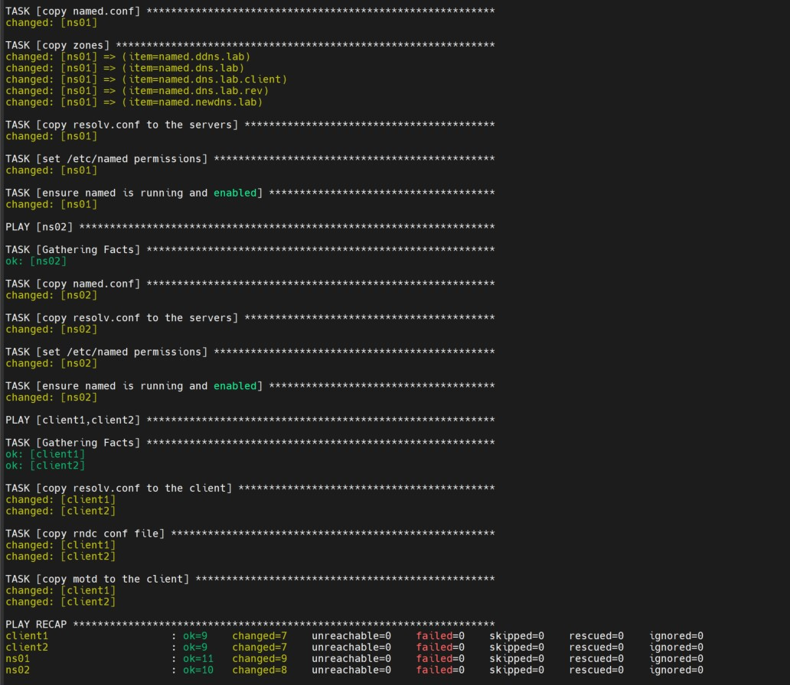
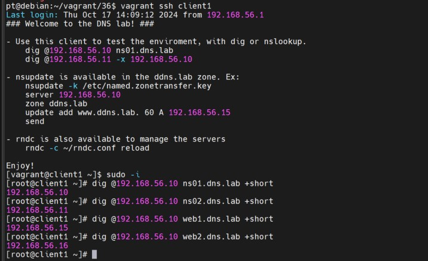
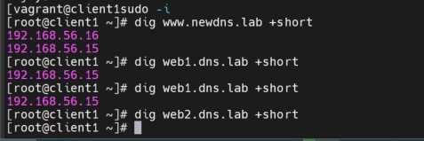
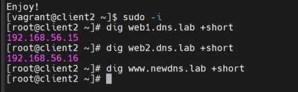

DNS. Настройка и обслуживание

Задание:

1. На предложенном стенде https://github.com/erlong15/vagrant-bind:
   - добавить сервер client2;
   - завести в зоне   dns.lab имена:
     - web1 - смотрит на client1;
     - web2 - смотрит на client2;
   - завести зону newdns.lab;
   - завести в новой зоне запись:
     - www - смотрит на обоих клиентов;
2. Настроить split-dns:
   - client1 - видит обе зоны, но в зоне dns.lab только web1;
   - client2 - видит только dns.lab;

1. 

Разворачиваем 4 виртуальные машины:

Vagrant up

Проверяем с клиента

2.

Меняем плейбук на playbook_split.yml
ansible.playbook = "provisioning/playbook_split.yml"

Vagrant up --provision

Проверяем с клиента1

client1 видит обе зоны dns.lab и newdns.lab

Проверяем с клиента2

client2 видит всю зону dns.lab и не видит зону newdns.lab
