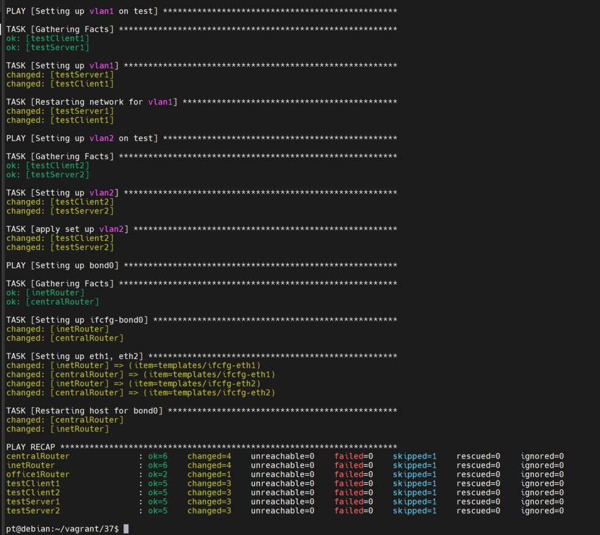
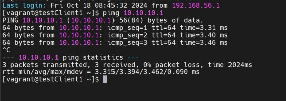
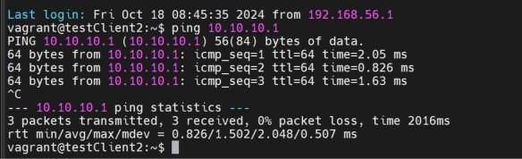
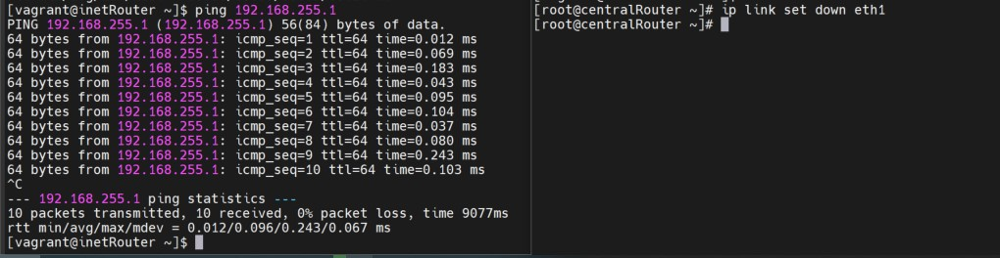

Строим бонды и вланы

Задание:

1. в Office1 в тестовой подсети появляется сервера с доп интерфейсами и адресами
в internal сети testLAN:

testClient1 - 10.10.10.254
testClient2 - 10.10.10.254
testServer1- 10.10.10.1
testServer2- 10.10.10.1

2. Равести вланами:
testClient1 <-> testServer1
testClient2 <-> testServer2
Между centralRouter и inetRouter "пробросить" 2 линка (общая inernal сеть) и объединить их в бонд, проверить работу c отключением интерфейсов

1. Разворачиваем 7 виртуальных машины:

Vagrant up

Проверяем с testClient1

Проверяем с testClient2

2.

Для того, чтобы проверить работоспособность конфигурации, необходимо запустить пинг с сервера inetRouter в направлении centralRouter, после чего отключить один физический интерфейс на centralRouter

как мы видим, пинг не прервался - все работает
