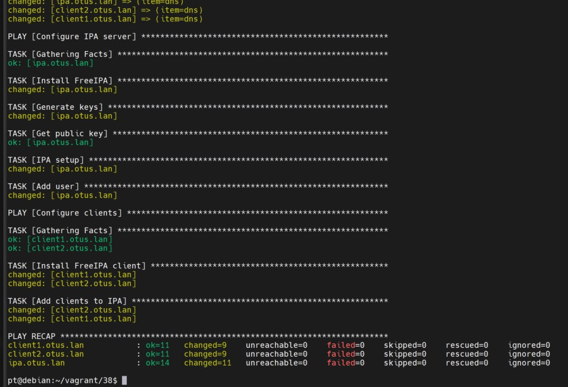
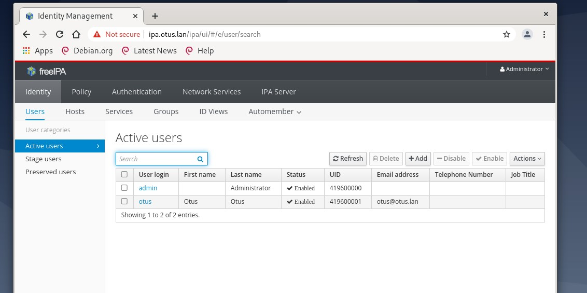
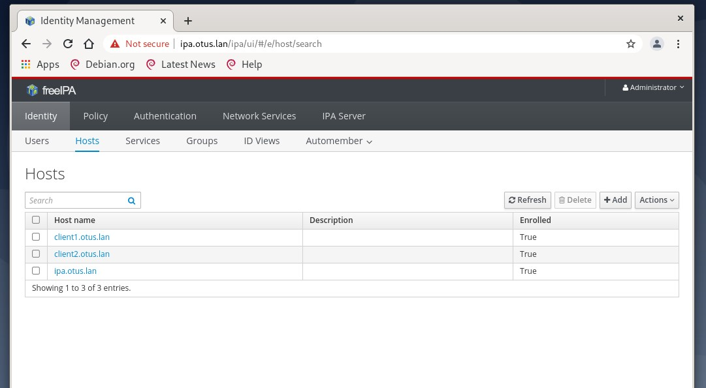

LDAP

Задание:

1) Установить FreeIPA
2) Написать Ansible-playbook для конфигурации клиента

1. 

Разворачиваем 3 виртуальных машины:

Vagrant up

Откроем c нашей хост-машины веб-страницу с Пользователями

Откроем c нашей хост-машины веб-страницу с Хостами

как мы видим - все работает
