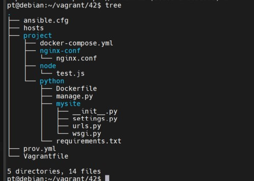
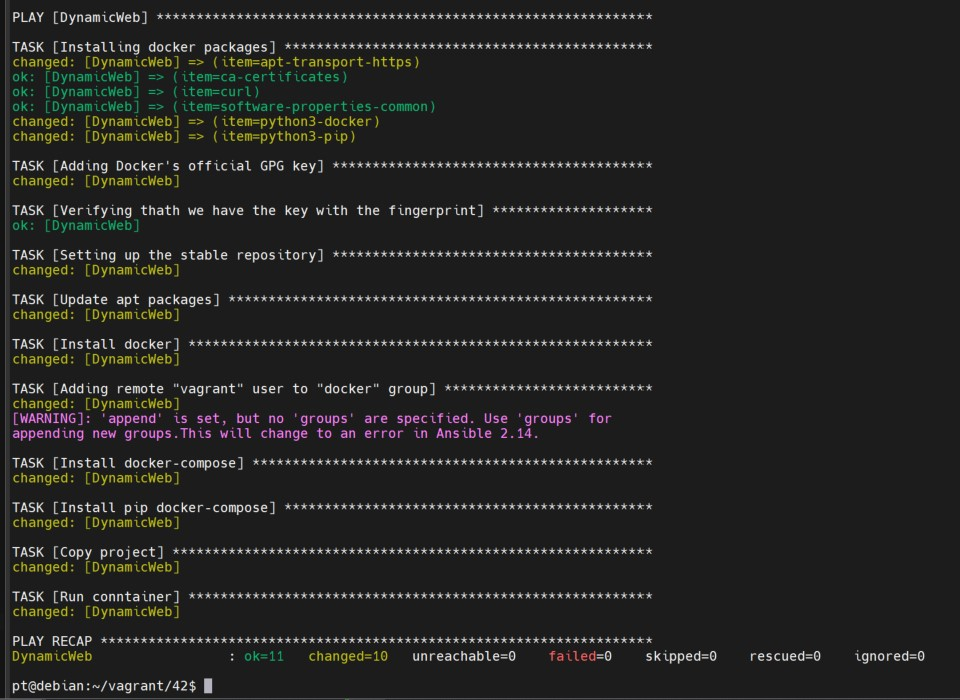
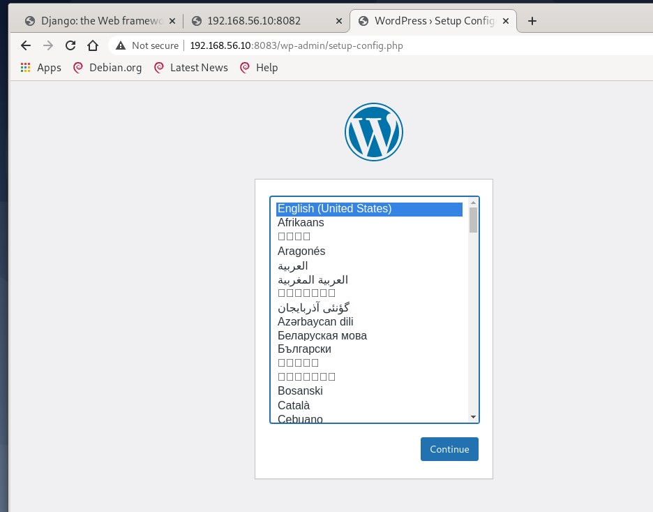
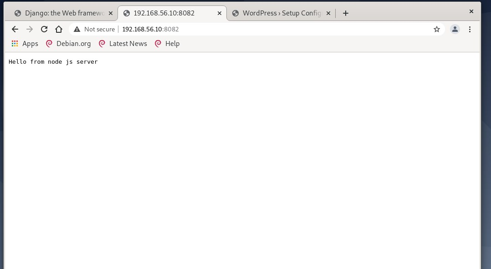
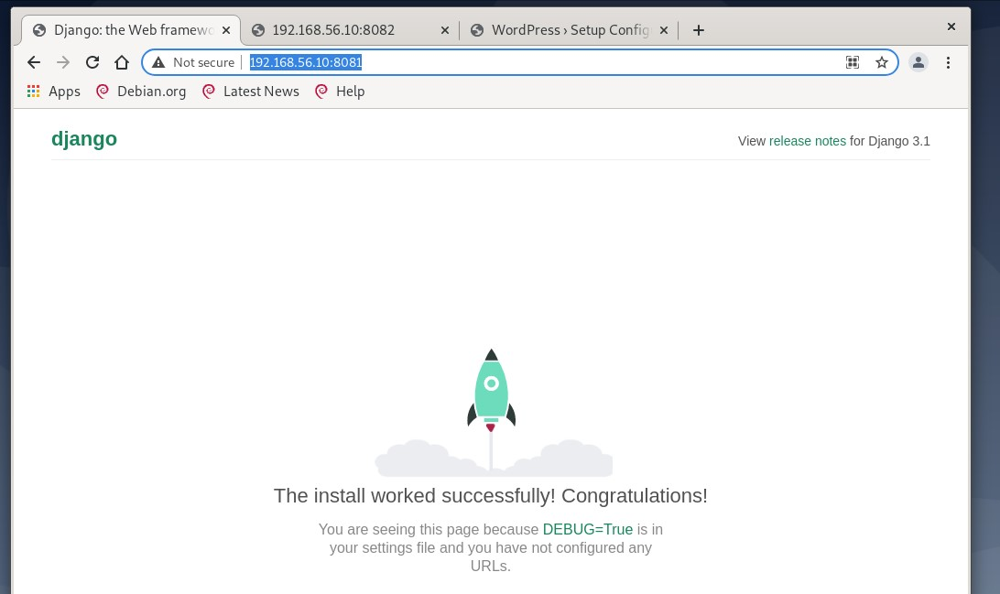

Развертывание веб приложения

Задание:

1)Развернуть стенд nginx + php-fpm (wordpress) + python (django) + js(node.js)

Создаем конфигурационные файлы, получается вот такое дерево

Разворачиваем виртуальную машину:

Vagrant up

Проверка:

Откроем c нашей хост-машины веб-страницу http://192.168.56.10:8083

Откроем c нашей хост-машины веб-страницу http://192.168.56.10:8082

Откроем c нашей хост-машины веб-страницу http://192.168.56.10:8081

как мы видим - все работает
